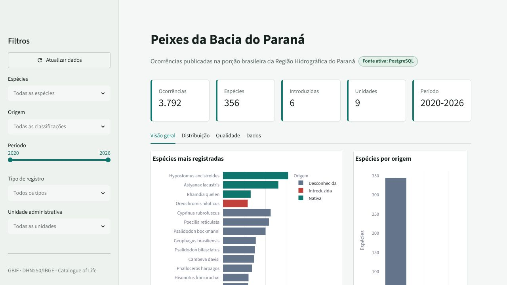
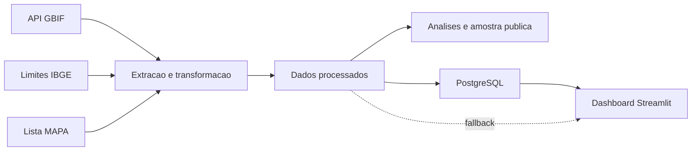

# Biodiversidade de peixes na Bacia do Parana


Pipeline reproducivel para coletar, padronizar, validar, analisar e visualizar
ocorrencias de peixes na Bacia Hidrografica do Parana. O projeto combina dados
do GBIF, limites geograficos oficiais e uma referencia de especies introduzidas,
com persistencia em PostgreSQL e um dashboard Streamlit.



## Resultados atuais

A amostra de desenvolvimento processada atualmente possui:

- 5.000 ocorrencias brutas obtidas do GBIF;
- 3.792 ocorrencias localizadas dentro da bacia;
- 356 especies distintas;
- 6 especies classificadas como introduzidas com base na referencia adotada;
- 555 registros separados para revisao por problemas de qualidade.

Esses numeros descrevem uma amostra limitada e nao representam um inventario
completo da ictiofauna da bacia.

## Arquitetura



O banco e a fonte preferencial do dashboard. Quando ele nao esta disponivel, a
aplicacao usa os CSVs processados como alternativa somente de leitura.
Ao selecionar um pais, o dashboard reutiliza os dados existentes no PostgreSQL.
O GBIF so e consultado quando o cache esta vazio ou quando o usuario aciona
**Atualizar dados do GBIF**.

## Tecnologias

Python 3.12, pandas, GeoPandas, Shapely, Requests, PostgreSQL, psycopg,
Streamlit, Plotly, Ruff e GitHub Actions.

## Inicio rapido

```powershell
python -m venv .venv
.\.venv\Scripts\Activate.ps1
python -m pip install -r requirements-dev.txt
Copy-Item .env.example .env
```

Preencha a conexao PostgreSQL em `.env` e execute o pipeline:

```powershell
python -m src.prepare_boundary
python -m src.extract_fish --pais BR --recorte-bacia
python -m src.transform_fish
python -m src.analysis
python -m src.export_sample
python -m src.load --dry-run
python -m src.load
streamlit run app/app.py
```

Downloads completos acima do limite da API de ocorrencias devem usar um
download autenticado do GBIF, que tambem permite registrar o DOI do conjunto.

## Verificacao

```powershell
.\scripts\verify.ps1
```

O script executa lint, verificacao de formatacao, testes, auditoria de
dependencias e validacao da carga. Os comandos tambem podem ser executados
separadamente:

```powershell
python -m ruff check src app tests
python -m ruff format --check src app tests
python -m unittest discover -s tests -v
python -m pip check
```

## Estrutura

```text
app/             dashboard Streamlit
data/raw/        entradas originais, ignoradas pelo Git
data/processed/  resultados completos, ignorados pelo Git
data/sample/     amostra redistribuivel e metadados
docs/            arquitetura, metodologia e guias operacionais
scripts/         verificacoes automatizadas
src/             extracao, transformacao, analise, carga e consultas
tests/           testes unitarios e de integracao
```

## Dados, citacao e limites

A amostra publica inclui apenas registros CC0 ou CC BY e preserva a licenca,
a chave do conjunto, a instituicao quando informada e o link da ocorrencia no
GBIF. Consulte [citacao e licencas](docs/CITACAO_E_LICENCAS.md) antes de
redistribuir resultados. O codigo-fonte ainda nao possui uma licenca de
software definida.

Limitacoes conhecidas incluem vies de amostragem, registros sem coordenadas,
identificacoes taxonomicas incompletas, sinonimos ainda nao resolvidos pela
fonte e ausencia eventual de metadados de publicacao na resposta da API.

## Documentacao

- [Arquitetura](docs/ARQUITETURA.md)
- [Escopo do MVP da versão 2](docs/ESCOPO_MVP_V2.md)
- [Configuração e refatoração da versão 2](docs/CONFIGURACAO_V2.md)
- [Busca multiespécies por país](docs/BUSCA_MULTIESPECIES_V2.md)
- [Recorte geografico](docs/RECORTE_GEOGRAFICO.md)
- [Taxonomia e especies introduzidas](docs/TAXONOMIA_E_STATUS.md)
- [Analises](docs/ANALISES.md)
- [PostgreSQL](docs/POSTGRESQL.md)
- [Cache e atualização pelo GBIF](docs/CACHE_E_ATUALIZACAO_V2.md)
- [Dashboard](docs/DASHBOARD.md)
- [Citacao e licencas](docs/CITACAO_E_LICENCAS.md)

Versao atual: **1.0.0**. Consulte o [historico de mudancas](CHANGELOG.md) e o
arquivo [CITATION.cff](CITATION.cff) para citar o software.
