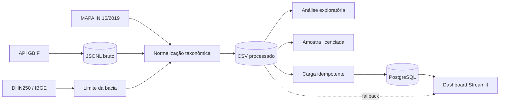

# Arquitetura

## Fluxo principal

## Módulos

| Módulo | Responsabilidade |
|---|---|
| `src.extract_fish` | Consulta paginada multiespécies e preservação da resposta bruta. |
| `src.prepare_boundary` | Prepara o limite oficial da Região Hidrográfica do Paraná. |
| `src.transform_fish` | Normaliza taxonomia, datas, origem, licença e recorte espacial. |
| `src.analysis` | Produz agregações, qualidade, mapas e relatório exploratório. |
| `src.export_sample` | Gera amostra pública restrita a CC0 e CC BY. |
| `src.load` | Cria/migra o schema PostgreSQL e executa `UPSERT`. |
| `src.query_db` | Executa consultas analíticas parametrizadas. |
| `src.dashboard_data` | Unifica PostgreSQL e fallback CSV para o dashboard. |
| `app.app` | Renderiza a experiência Streamlit. |

## Camadas de dados

### Bruta

`data/raw/` preserva respostas originais do GBIF em JSONL. Esses arquivos são ignorados pelo Git para evitar volume e republicação acidental.

### Processada

`data/processed/` contém ocorrências normalizadas, espécies e problemas taxonômicos. A transformação é reproduzível a partir da camada bruta e do limite geográfico.

### Analítica

`data/analysis/` contém tabelas agregadas, gráficos, mapas e relatórios. Toda a pasta é regenerável por `python -m src.analysis`.

### Demonstração

`data/sample/` é a única camada de ocorrências versionada. Ela preserva atribuição e exclui licenças CC BY-NC.

## PostgreSQL

O schema `biodiversity` possui:

- `species`, com `species_key` como chave primária;
- `occurrences`, com `gbif_id` como chave primária e referência a `species`;
- `load_runs`, com checksum e contagem de cada carga;
- views para ranking, séries anuais e detalhes das ocorrências.

A criação usa `CREATE ... IF NOT EXISTS` e migra colunas de atribuição com `ADD COLUMN IF NOT EXISTS`. A carga usa uma transação e `UPSERT`, portanto pode ser repetida sem duplicar chaves.

## Decisões de segurança

- credenciais ficam em `.env`, ignorado pelo Git;
- nomes de schema são validados antes de interpolação SQL;
- valores de consulta usam parâmetros do Psycopg;
- o dashboard nunca exibe a URL de conexão;
- o código não remove candidatos a duplicidade automaticamente;
- ausência de evidência de origem permanece `UNKNOWN`.

## Qualidade automatizada

O workflow `.github/workflows/ci.yml` executa em Python 3.12:

1. instalação de dependências;
2. lint com Ruff;
3. verificação de formatação;
4. testes com `unittest`.

Testes que exigem PostgreSQL real ou dados locais são ignorados automaticamente quando a fonte não está configurada.
